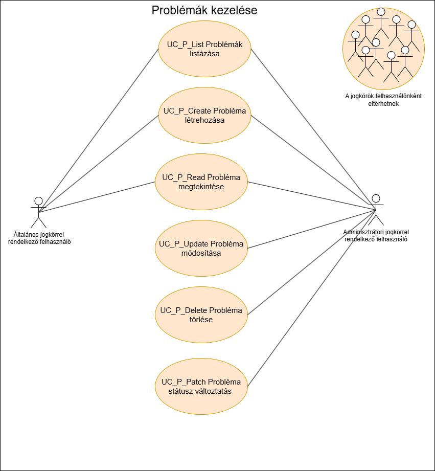

= Problémák kezelése funkcionális modell

== Leírás
Csak bejelentkezett felhasználó tud új problémát felvenni és a problémákat megtekinteni, kezelni.

== Használati esetek

=== Hazsnálati esetek rövid leírása
==== Problémák listázása
[cols="1h,3"]
|===

|Azonosító
|UC_P_List

|Kiváltó esemény
|A felhasználó listázza a problémákat

|Felhasználók
|Általános felhasználók, Adminisztrátorok

|Elsődleges lefutás
|
1. A felhasználó a Problémák listázásamenüpontra kattint

2. A rendszerben kiválogatásra kerülnek a problémák

|Kivételek és alternetívák
| -

|Utófeltétel
|A rendszerben a problémák listája előállt

|Eredmény
|A felhasználó látja a problémák listáját, kiválaszthat közülük egyet

|Használati eset realizáció
|Technikai modell

|===

==== Probléma rögzítése
[cols="1h,3"]
|===

|Azonosító
|UC_P_Create

|Kiváltó esemény
|A felhasználó új problémát rögzít

|Felhasználók
|Általános felhasználók, Adminisztrátorok

|Elsődleges lefutás
|
1. A felhasználó megatdja a probléma létrehozásához szükséges adatokat

2. Elindítja a rögzítés folyamatát

3. A rendszerben rögzítésre kerül az új probléma

|Kivételek és alternetívák
| -

|Utófeltétel
|A rendszerben az új probléma rögzítésre került

|Eredmény
|A felhasználó számára látható lesz az imént rögzített probléma

|Használati eset realizáció
|Technikai modell
|===

==== Probléma megtekintése
[cols="1h,3"]
|===

|Azonosító
|UC_P_Read

|Kiváltó esemény
|A felhasználó megtekinti a kiválasztott probléma metaadatait

|Felhasználók
|Általános felhasználók, Adminisztrátorok

|Elsődleges lefutás
|
1. A felhasználó kiválasztja a problémát

2. A rendszerben lekérdezésre került a kiválasztott probléma

|Kivételek és alternetívák
| -

|Utófeltétel
|A rendszerben a probléma lekérdezésre került

|Eredmény
|A felhasználó látja a kiválasztott probléma adatait

|Használati eset realizáció
|Technikai modell
|===

==== Probléma módosítása
[cols="1h,3"]
|===

|Azonosító
|UC_P_Update

|Kiváltó esemény
|A felhasználó módosítani szeretné a kiválasztott probléma adatait

|Felhasználók
|Általános felhasználók, Adminisztrátorok

|Elsődleges lefutás
|
1. A felhasználó megatdja a módosítani kivánt adatokat

2. Elindítja a módosítás folyamatát

3. A rendszerben móduslnak a probléma adatai

|Kivételek és alternetívák
| -

|Utófeltétel
|A rendszerben a probléma módosításra kerül

|Eredmény
|A felhasználó látja a probléma módosított adatait

|Használati eset realizáció
|Technikai modell
|===

==== Probléma státuszának módosítása
[cols="1h,3"]
|===

|Azonosító
|UC_P_Patch

|Kiváltó esemény
|A felhasználó modosítani szeretné a probléma státuszát

|Felhasználók
| Adminisztrátorok

|Elsődleges lefutás
|
1. A felhasználó megatdja a probléma státuszának új értékét

2. A rendszerben módosul a probléma adatai

|Kivételek és alternetívák
| -

|Utófeltétel
|A rendszerben a probléma módosításra kerül

|Eredmény
|A felhasználó látja a probléma módosított adatait

|Használati eset realizáció
|Technikai modell
|===

== Jogosultságok
[cols="1,1,1"]
|===
|Használati esetek|Jogosultság | Szerepkörök

|Problémák listázása
|PROBLEM_LIST
|Általános felhasználó, Adminisztrátor

|Probléma rögzítése
|PROBLEM_CREATE
|Általános felhasználó, Adminisztrátor

|Probléma megtekintése
|PROBLEM_READ
|Általános felhasználó, Adminisztrátor

|Probléma módosítása
|PROBLEM_UPDATE
|Általános felhasználó, Adminisztrátor

|Probléma státuszának módosítása
|PROBLEM_PATCH
|Általános felhasználó, Adminisztrátor
|===

== Felületi terv

=== Problémák listázása felület
image::../static/UI/premlemListUI.PNG[[Problémák listázása felület]]
==== Felületen lévő mezők

[cols="1,1,1,1,1"]
|===
|Név|Típus|Kötelező?|Szerkezthető?|Megjelenés

|Probléma azonosítója
|Címke
|-
|-
|Találati lista ablakrész

|Probléma neve
|Címke
|-
|-
|Találati lista ablakrész

|Probléma leírása
|Címke
|-
|-
|Találati lista ablakrész

|Probléma hozzáadásának dátuma
|Címke
|-
|-
|Találati lista ablakrész

|Probléma típusa
|Címke
|-
|-
|Találati lista ablakrész

|===

==== A felületről elérhető műveletek
[cols="1,1,1"]
|===
|Esemény|Leírás|Jogosúltság

|Oldal betöltésénél
|Végrehajtásra kerül a problémák listázása használati eset.
A találati listában megjelnnek a kiválogatott problémák.
|PROBLEM_LIST

|A Megtekintés gombra kattintva
|Végrehajtásra kerül a Probléma megtekintése használati eset.
A felhasználó a megtekintő felületen látja a kiválasztott Probléma adatait.
|PROBLEM_READ

|===

==== A felületen lévő mezők
[cols="1,1,1,1,1"]
|===
|Megnevezés|Típus|Kötelező|Szerekeszthető|Validáció

|Név
|Szöveges input mező
|I
|I
|

|Leírás
|Szöveges input mező
|I
|I
|

|Dátum
|
|N
|N
|Nem lehet a mai dátumtól későbbi

|Probléma típus
|Lenyíló lista
|I
|I
|

|Probléma státusza
|
|N
|N
|

|===

=== Probléma rögzítése és módosítása felület

image::../static/UI/problemUpdateUI.PNG[Probléma szerkesztése felület]
==== A felületen elérhető műveletek
[cols="1,1,1,1"]
|===
|Esemény|Leírás|Felület|Jogosultság

|A Mentés gombra kattintás
|Végrahajtásra kerül a probléma rögzítése használati eset.
A felhasználó a probléma megtekintése felületre jut.

Az űrlapot addig nem lehet beküldeni ameddig nincs minden mező helyesen kitöltve.
|Probléma létrehozása felület
|PROBLEM_CREATE

|A Mentés gombra kattintás
|Végrehajtásra kerül a Probléma módosítása használati eset.
A felhasználó a probléma megtekintése fülre jut.

|Probléma módosítása felület
|PROBLEM_UPDATE

|===

=== Probléma megtekintése felület
==== Arculat

==== A felületen lévő mezők
[cols="1,1"]
|===
|Megnevezés|Típus

|Probléma neve
|Szöveges címke

|Probléma leírása
|Szöveges címke

|Dátum
|Szöveges címke

|Probléma típus
|Szöveges címke

|Probléma státusz
|Szöveges címke

|===

==== A felületről elérhető műveletek
[cols="1,1,1"]
|===
|Esemény|Leírás|Jogosultság

|A megtekintés gombra kattintás
|A felhasználó a probléma megtekintése felületre jut
|-

|A Törlés gombra kattintás
|Egy megerősítő párbeszédablak után törlődik a probléma
|PROBLEM_DELETE

|===

link:../functional-models.adoc[Vissza]
