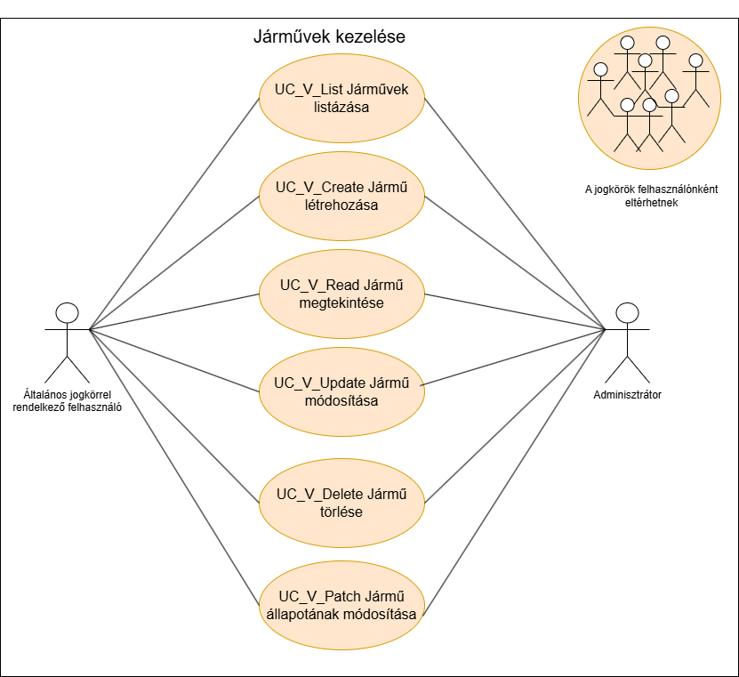
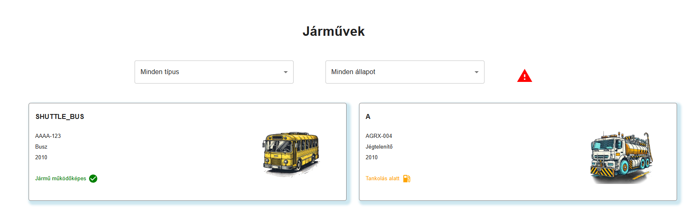

= Járművek kezelése funkcionális modell

== Leírás
Csak bejelentkezett felhasználó tud új járművet felvenni, törölni, vagy módosítani.

== Használati estek

=== Hazsnálati esetek rövid leírása
==== Járművek listázása

[cols="1h,3"]
|===

|Azonosító
|UC_V_List

|Kiváltó esemény
|A felhasználó listázza a járműveket

|Felhasználók
|Általános felhasználók, Adminisztrátorok

|Elsődleges lefutás
|
1. A felhasználó a járművek listázásamenüpontra kattint

2. A rendszerben kiválogatásra kerülnek a járművek

|Kivételek és alternetívák
| -

|Utófeltétel
|A rendszerben a járművek listája előállt

|Eredmény
|A felhasználó látja a járművek listáját, kiválaszthat közülük egyet

|Használati eset realizáció
|Technikai modell

|===

==== Jármű rögzítése
[cols="1h,3"]
|===

|Azonosító
|UC_V_Create

|Kiváltó esemény
|A felhasználó új járművet kíván rögzíteni

|Felhasználók
|Általános felhasználók, Adminisztrátorok

|Elsődleges lefutás
|
1. A felhasználó megatdja a jármű létrehozásához szükséges adatokat

2. Elindítja a rögzítés folyamatát

3. A rendszerben rögzítésre kerül az új jármű

|Kivételek és alternetívák
|-

|Utófeltétel
|A rendszerben az új jármű rögzítésre került

|Eredmény
|A felhasználó számára látható lesz az imént rögzített jármű

|Használati eset realizáció
|Technikai modell
|===

==== Jármű megtekintése
[cols="1h,3"]
|===

|Azonosító
|UC_V_Read

|Kiváltó esemény
|A felhasználó megtekinti a kiválasztott jármű metaadatait

|Felhasználók
|Általános felhasználók, Adminisztrátorok

|Elsődleges lefutás
|
1. A felhasználó kiválasztja a járművet

2. A rendszerben lekérdezésre került a kiválasztott jármű

|Kivételek és alternetívák
| -

|Utófeltétel
|A rendszerben a jármű lekérdezésre került

|Eredmény
|A felhasználó látja a kiválasztott jármű adatait

|Használati eset realizáció
|Technikai modell
|===

==== Jármű módosítása
[cols="1h,3"]
|===

|Azonosító
|UC_V_Update

|Kiváltó esemény
|A felhasználó módosítani szeretné a kiválasztott jármű adatait

|Felhasználók
|Általános felhasználók, Adminisztrátorok

|Elsődleges lefutás
|
1. A felhasználó megatdja a módosítani kivánt adatokat

2. Elindítja a módosítás folyamatát

3. A rendszerben móduslnak a jármű adatai

|Kivételek és alternetívák
| -

|Utófeltétel
|A rendszerben a jármű módosításra kerül

|Eredmény
|A felhasználó látja a jármű módosított adatait

|Használati eset realizáció
|Technikai modell
|===

==== Jármű állapotának frissítése
[cols="1h,3"]
|===

|Azonosító
|UC_V_Patch

|Kiváltó esemény
|A felhasználó módosítani szeretné a kiválasztott jármű állapotát

|Felhasználók
|Általános felhasználók, Adminisztrátorok

|Elsődleges lefutás
|
1. A felhasználó megatdja a módosítani kivánt adatokat

2. Elindítja a módosítás folyamatát

3. A rendszerben móduslnak a jármű adatai

|Kivételek és alternetívák
| -

|Utófeltétel
|A rendszerben a jármű módosításra kerül

|Eredmény
|A felhasználó látja a jármű módosított adatait

|Használati eset realizáció
|Technikai modell
|===

== Jogosultságok
[cols="1,1,1"]
|===
|Használati esetek|Jogosultság | Szerepkörök

|Járművek listázása
|VEHICLE_LIST
|Általános felhasználó, Adminisztrátor

|Jármű rögzítées
|VEHICLE_CREATE
|Általános felhasználó, Adminisztrátor

|Jármű megtekintése
|VEHICLE_READ
|Általános felhasználó, Adminisztrátor

|Jármű Módosítása
|VEHICLE_UPDATE
|Általános felhasználó, Adminisztrátor

|Jármű törlése
|VEHICLE_DELETE
|Általános felhasználó, Adminisztrátor

|Jármű állapotának frissítése
|VEHICLE_PATCH
|Általános felhasználó, Adminisztrátor
|===

== Felületi terv

=== Járművek listázása felület

==== Felületen lévő mezők

[cols="1,1,1,1,1"]
|===
|Név|Típus|Kötelező?|Szerkezthető?|Megjelenés

|Jármű fényképe
|Kép
|-
|-
|Találati lista ablakrész

|Jármű neve
|Címke
|-
|-
|Találati lista ablakrész

|Jármű rendszáma
|Címke
|-
|-
|Találati lista ablakrész

|Jármű állapota
|Címke
|-
|-
|Találati lista ablakrész

|===

==== A felületről elérhető műveletek
[cols="1,1,1"]
|===
|Esemény|Leírás|Jogosúltság

|Oldal betöltésénél
|Végrehajtásra kerül a járművek listázása használati eset.
A találati listában megjelnnek a kiválogatott járművek.
|VEHICLE_LIST

|A Megtekintés gombra kattintva
|Végrehajtásra kerül a járművek megtekintése használati eset.
A felhasználó a megtekintő felületen látja a kiválasztott jármű adatait.
|VEHICLE_READ

|===

==== A felületen lévő mezők
[cols="1,1,1,1,1"]
|===
|Megnevezés|Típus|Kötelező|Szerekeszthető|Validáció

|Név
|Szöveges input mező
|I
|I
|

|Rendszám
|Szöveges input mező
|I
|N
|

|Állapot
|Szöveges input mező
|I
|I
|

|===

=== Járművek rögzítése és módosítása felület
==== Arculat
==== A felületen elérhető műveletek
[cols="1,1,1,1"]
|===
|Esemény|Leírás|Felület|Jogosultság

|A Mentés gombra kattintás
|Végrahajtásra kerül a járművek rögzítése használati eset.
A felhasználó a jármű megtekintése felületre jut.

Az űrlapot addig nem lehet beküldeni ameddig nincs minden mező helyesen kitöltve.
|Jármű létrehozása felület
|VEHICLE_CREATE

|A Mentés gombra kattintás
|Végrehajtásra kerül a jármű módosítása használati eset.
A felhasználó a jármű megtekintése fülre jut.

|Jármű módosítása felület
|VEHICLE_UPDATE

|===

=== Jármű megtekintése felület
==== Arculat

==== A felületen lévő mezők
[cols="1,1"]
|===
|Megnevezés|Típus

|Jármű neve
|Szöveges címke

|Jármű fényképe
|Kép

|Rendszám
|Szöveges címke

|Állapot
|Szöveges címke

|===

==== A felületről elérhető műveletek
[cols="1,1,1"]
|===
|Esemény|Leírás|Jogosultság

|A megtekintés gombra kattintás
|A felhasználó a járművek megtekintése felületre jut
|-

|A Törlés gombra kattintás
|Egy megerősítő párbeszédablak után törlődik a jármű
|VEHICLE_DELETE

|===

link:../functional-models.adoc[Vissza]