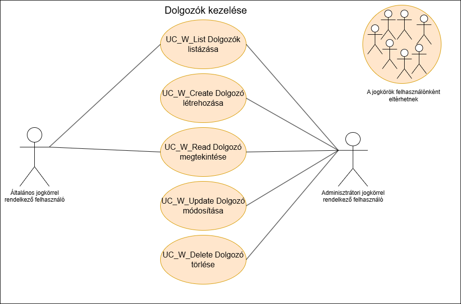
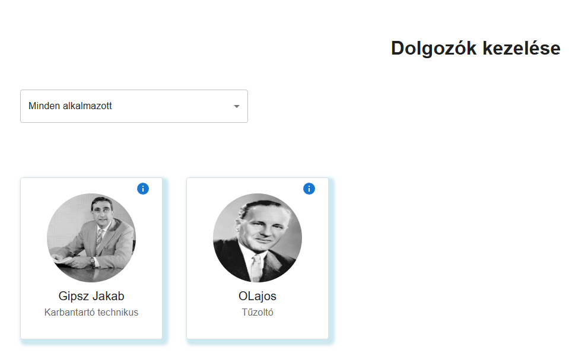

= Dolgozók kezelése funkcionális modell

== Leírás
Csak bejelentkezett felhasználó tud új dolgozót felvenni, törölni, vagy módosítani.

== Használati esetek

=== Hazsnálati esetek rövid leírása
==== Dolgozók listázása

[cols="1h,3"]
|===

|Azonosító
|UC_W_List

|Kiváltó esemény
|A felhasználó listázza a dolgozókat

|Felhasználók
|Általános felhasználók, Adminisztrátorok

|Elsődleges lefutás
|
1. A felhasználó a Dolgozók listázásamenüpontra kattint

2. A rendszerben kiválogatásra kerülnek a dolgozók

|Kivételek és alternetívák
| -

|Utófeltétel
|A rendszerben a dolgozók listája előállt

|Eredmény
|A felhasználó látja a dolgozók listáját, kiválaszthat közülük egyet

|Használati eset realizáció
|Technikai modell

|===

==== Dolgozó rögzítése
[cols="1h,3"]
|===

|Azonosító
|UC_W_Create

|Kiváltó esemény
|A felhasználó új dolgozót rögzít

|Felhasználók
|Adminisztrátorok

|Elsődleges lefutás
|
1. A felhasználó megatdja a dolgozó létrehozásához szükséges adatokat

2. Elindítja a rögzítés folyamatát

3. A rendszerben rögzítésre kerül az új dolgozó

|Kivételek és alternetívák
|Ha a dolgozó már létezik nem vehető fel ugyanazokkal az adatokkal.

|Utófeltétel
|A rendszerben az új dolgozó rögzítésre került

|Eredmény
|A felhasználó számára látható lesz az imént rögzített dolgozó

|Használati eset realizáció
|Technikai modell
|===

==== Dolgozó megtekintése
[cols="1h,3"]
|===

|Azonosító
|UC_W_Read

|Kiváltó esemény
|A felhasználó megtekinti a kiválasztott dolgozó metaadatait

|Felhasználók
|Általános felhasználók, Adminisztrátorok

|Elsődleges lefutás
|
1. A felhasználó kiválasztja a dolgozót

2. A rendszerben lekérdezésre került a kiválasztott dolgozó

|Kivételek és alternetívák
| -

|Utófeltétel
|A rendszerben a dolgozó lekérdezésre került

|Eredmény
|A felhasználó látja a kiválasztott dolgozó adatait

|Használati eset realizáció
|Technikai modell
|===

==== Dolgozó módosítása
[cols="1h,3"]
|===

|Azonosító
|UC_W_Update

|Kiváltó esemény
|A felhasználó módosítani szeretné a kiválasztott dolgozó adatait

|Felhasználók
|Adminisztrátorok

|Elsődleges lefutás
|
1. A felhasználó megatdja a módosítani kivánt adatokat

2. Elindítja a módosítás folyamatát

3. A rendszerben móduslnak a dolgozó adatai

|Kivételek és alternetívák
| -

|Utófeltétel
|A rendszerben a dolgozó módosításra kerül

|Eredmény
|A felhasználó látja a dolgozó módosított adatait

|Használati eset realizáció
|Technikai modell
|===

== Jogosultságok
[cols="1,1,1"]
|===
|Használati esetek|Jogosultság | Szerepkörök

|Dolgozók listázása
|WORKER_LIST
|Általános felhasználó, Adminisztrátor

|Dolgozó rögzítése
|WORKER_CREATE
|Adminisztrátor

|Dolgozó megtekintése
|WORKER_READ
|Általános felhasználó, Adminisztrátor

|Dolgozó módosítása
|WORKER_UPDATE
|Adminisztrátor

|Dolgozó Törlése
|WORKER_DELETE
|Adminisztrátor
|===

== Felületi terv

=== Dolgozók listázása felület

==== Felületen lévő mezők

[cols="1,1,1,1,1"]
|===
|Név|Típus|Kötelező?|Szerkezthető?|Megjelenés

|Dolgozó fényképe
|Kép
|-
|-
|Találati lista ablakrész

|Dolgozó neve
|Címke
|-
|-
|Találati lista ablakrész

|Dolgozó munkaköre
|Címke
|-
|-
|Találati lista ablakrész

|Dolgozó email címe
|Címke
|-
|-
|Találati lista ablakrész

|Dolgozó telefonszáma
|Címke
|-
|-
|Találati lista ablakrész

|===

==== A felületről elérhető műveletek
[cols="1,1,1"]
|===
|Esemény|Leírás|Jogosúltság

|Oldal betöltésénél
|Végrehajtásra kerül a dolgozók listázása használati eset.
A találati listában megjelnnek a kiválogatott dolgozók.
|WORKER_LIST

|A Megtekintés gombra kattintva
|Végrehajtásra kerül a dolgozó megtekintése használati eset.
A felhasználó a megtekintő felületen látja a kiválasztott dolgozó adatait.
|WORKER_READ

|===

==== A felületen lévő mezők
[cols="1,1,1,1,1"]
|===
|Megnevezés|Típus|Kötelező|Szerekeszthető|Validáció

|Név
|Szöveges input mező
|I
|I
|

|Munkakör
|Szöveges input mező
|I
|I
|

|Telefonszám
|Szöveges input mező
|I
|I
|

|Email
|Szöveges input mező
|I
|I
|

|Fizetés
|Szöveges input mező
|I
|I
|

|===

=== Dolgozó rögzítése és módosítása felület
==== Arculat
==== A felületen elérhető műveletek
[cols="1,1,1,1"]
|===
|Esemény|Leírás|Felület|Jogosultság

|A Mentés gombra kattintás
|Végrahajtásra kerül a dolgozó rögzítése használati eset.
A felhasználó a dolgozó megtekintése felületre jut.

Az űrlapot addig nem lehet beküldeni ameddig nincs minden mező helyesen kitöltve.
|Dolgozó létrehozása felület
|WORKER_CREATE

|A Mentés gombra kattintás
|Végrehajtásra kerül a dolgozó módosítása használati eset.
A felhasználó a dolgozó megtekintése fülre jut.

|Dolgozó módosítása felület
|WORKER_UPDATE

|===

=== Dolgozó megtekintése felület
==== Arculat

==== A felületen lévő mezők
[cols="1,1"]
|===
|Megnevezés|Típus

|Dolgozó neve
|Szöveges címke

|Dolgozó fényképe
|Kép

|Dolgozó email címe
|Szöveges címke

|Dolgozó telefonszáma
|Szöveges címke

|Dolgozó fizetése
|Szöveges címke

|===

==== A felületről elérhető műveletek
[cols="1,1,1"]
|===
|Esemény|Leírás|Jogosultság

|A megtekintés gombra kattintás
|A felhasználó a dolgozó megtekintése felületre jut
|-

|A Törlés gombra kattintás
|Egy megerősítő párbeszédablak után törlődik a dolgozó
|WORKER_DELETE

|===

link:../functional-models.adoc[Vissza]