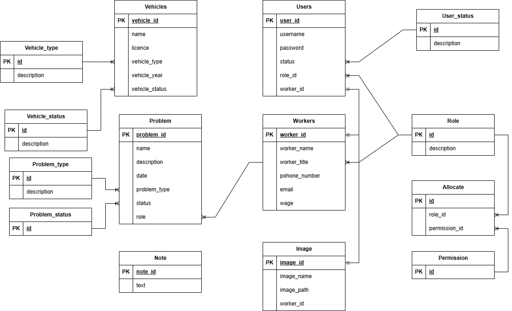

= Adatbázis felépítése és működése

== Adattáblák

=== Adattáblák rövid leírása
==== Járművek tábla
[cols="1,1,1"]
|===
|Oszlop név|Típus | Leírás

|vehicle_id
|INT
|Egyedi azonosító

|name
|VARCHAR(30)
|A jármű neve

|license
|VARCHAR(10)
|A jármű rendszáma

|vehicle_type
|VARCHAR(100)
|A jármű típusa(enum)

|vehicle_year
|INT
|A jármű évjárata

|vehicle_status
|VARCHAR(30)
|A jármű állapota(enum)
|===

==== Problémák tábla
[cols="1,1,1"]
|===
|Oszlop név|Típus | Leírás

|problem_id
|INT
|Egyedi azonosító

|name
|VARCHAR(50)
|A probléma megnevezése

|description
|VARCHAR(100)
|A probléma leírása

|datum
|VARCHAR(30)
|A probléma rögzítésének dátuma

|problem_type
|VARCHAR(30)
|A probléma típusa(enum)

|status
|VARCHAR(30)
|A probléma státusza(enum)

|role
|VARCHAR(30)
|A problémát megoldó dolgozó munkaköre(enum)
|===

==== Felhasználók tábla
[cols="1,1,1"]
|===
|Oszlop név|Típus | Leírás

|id
|INT
|Egyedi azonosító

|username
|VARCHAR(30)
|A felhasználó felhasználóneve

|password
|VARCHAR(100)
|A felhasználó jelszava

|role_id
|VARCHAR(30)
|A felhasználó munkakörének megnevezése(enum)

|status
|VARCHAR(30)
|A felhasználó állapota(enum)

|worker_id
|INT
|A felhasználóhoz tartozó dolgozó egyedi azonosítója
|===

==== Dolgozók tábla
[cols="1,1,1"]
|===
|Oszlop név|Típus | Leírás

|worker_id
|INT
|Egyedi azonosító

|worker_name
|VARCHAR(30)
|A dolgozó neve

|worker_title
|VARCHAR(30)
|A dolgozó munkaköre(enum)

|phone_number
|VARCHAR(30)
|A dolgozó telefonszáma

|email
|VARCHAR(30)
|A dolgozó email címe

|wage
|INT
|A dolgozó fizetése
|===

==== Image tábla
[cols="1,1,1"]
|===
|Oszlop név|Típus | Leírás

|image_id
|INT
|Egyedi azonosító

|image_name
|VARCHAR(30)
|A képfájl neve

|image_path
|VARCHAR(30)
|A kép elérési útja

|worker_id
|INT
|A dolgozó akihez a fénykép tartozik
|===

==== Note tábla
[cols="1,1,1"]
|===
|Oszlop név|Típus | Leírás

|note_id
|INT
|Egyedi azonosító

|text
|VARCHAR(50)
|A jegyzet szövege
|===

==== User_status tábla
[cols="1,1,1"]
|===
|Oszlop név|Típus | Leírás

|id
|VARCHAR(30)
|Egyedi azonosító

|description
|VARCHAR(100)
|A az enum leírása
|===

==== Role tábla
[cols="1,1,1"]
|===
|Oszlop név|Típus | Leírás

|id
|VARCHAR(30)
|Egyedi azonosító

|description
|VARCHAR(100)
|A az enum leírása
|===

==== Vehicle_type tábla
[cols="1,1,1"]
|===
|Oszlop név|Típus | Leírás

|id
|VARCHAR(30)
|Egyedi azonosító

|description
|VARCHAR(100)
|A az enum leírása
|===

==== Vehicle_status tábla
[cols="1,1,1"]
|===
|Oszlop név|Típus | Leírás

|id
|VARCHAR(30)
|Egyedi azonosító

|description
|VARCHAR(100)
|A az enum leírása
|===

==== Problem_type tábla
[cols="1,1,1"]
|===
|Oszlop név|Típus | Leírás

|id
|VARCHAR(30)
|Egyedi azonosító

|description
|VARCHAR(100)
|A az enum leírása
|===

==== Problem_status tábla
[cols="1,1,1"]
|===
|Oszlop név|Típus | Leírás

|id
|VARCHAR(30)
|Egyedi azonosító
|===

==== Allocate tábla
[cols="1,1,1"]
|===
|Oszlop név|Típus | Leírás

|role_id
|VARCHAR(30)
|A role enumnak az egyedi azonosítója

|permission_id
|VARCHAR(300)
|A jogkör egyedi azonosítója
|===

==== Permission tábla
[cols="1,1,1"]
|===
|Oszlop név|Típus | Leírás

|id
|VARCHAR(30)
|Egyedi azonosító
|===

link:../technical-models.adoc[Vissza]